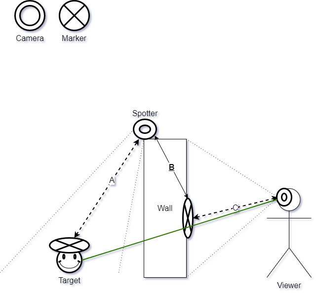

# ARWallhack

## Unity
The mobile Unity app uses ARCore for Android.
Image tracking is used to find the marker on the wall as an initial reference point.
Afterwards, Unity can track the movement of the phone camera, independent of the marker.
Once this common origin is established, the app uses the coordinates the server sent to render the targets.

## Scene Graph
The `A` transformation is calculated through simple OpenCV marker tracking.
`B` is a fixed transformation that describes the position of the marker on the wall in relation to the Spotter camera.
The coordinate of the target is transformed into the coordinate system of the marker on the wall, which is also the same coordinate system that the Viewer has.

